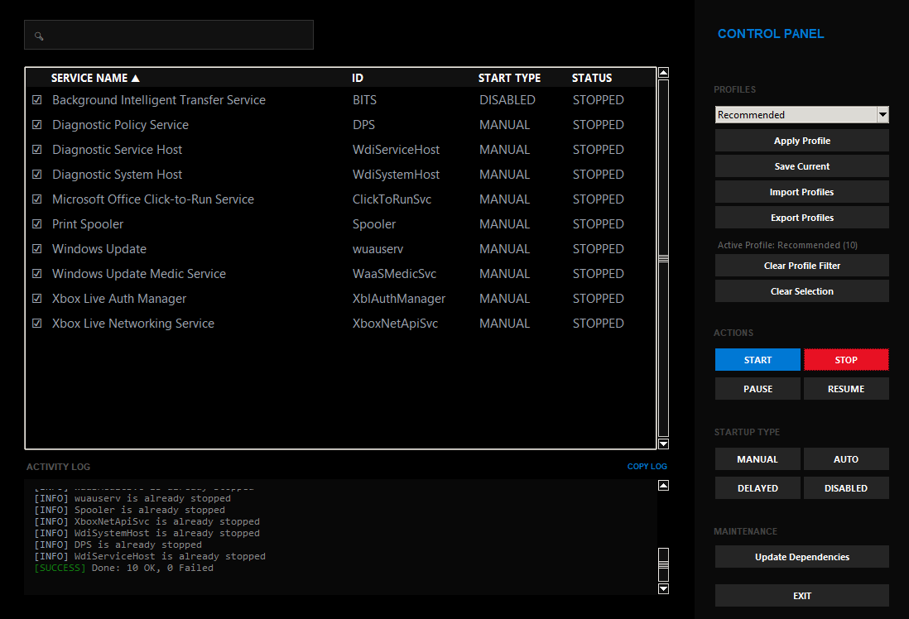

# Service Stopper

A Windows Service management tool built with Python and Tkinter. This application allows users to view and control system services in bulk, providing a faster alternative to the native services window for managing multiple services at once.



## Features

- **UI Integration**: Uses Windows system colors and native themes.
- **Service Control**: Multi-threaded start/stop operations to keep the UI responsive.
- **Profiles**: Load and save service selections using JSON files.
- **Sorting**: Sort services by name, ID, status, or start type.
- **Search**: Filter the service list by name or ID.
- **Bulk Selection**: Includes a master checkbox for selecting multiple services at once.
- **Logging**: Displays activity logs with a 2000-line limit to manage memory.
- **Privileges**: Requests Administrator access automatically when required.
- **Dependencies**: Checks for and installs required Python packages on startup.

## Installation and Usage

1. Clone or download the source code.
2. (Optional) Install dependencies manually:
   ```bash
   pip install -r requirements.txt
   ```
3. Run the script:
   ```bash
   python ServiceStopper.py
   ```

## Instructions

- **Select**: Use the checkboxes to pick services for action.
- **Actions**: Click Start or Stop in the control panel to apply changes to selected services.
- **Profiles**: Use the dropdown to apply or save sets of services.
- **Filter**: Use the search bar to find specific services.
